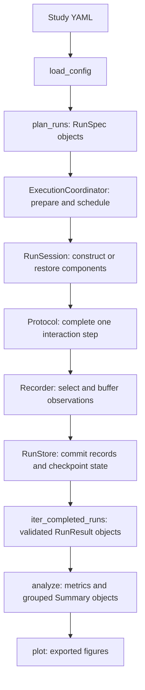

# Reading the code

This guide is a route through the repository for someone inspecting how it works.
Start with one small study, follow its data through the library, and use the tests
to check your understanding. The [architecture](ARCHITECTURE.md) describes the
design rules in more detail; the [configuration guide](CONFIGURATION.md) is the
reference for writing studies.

## Start here

Read these files in order on a first pass:

1. [The sequential study YAML](../examples/sequential_study/experiment.yml):
   identify the algorithm, data generator, protocol, budget, recorded fields,
   metric, and figure. Each is a separate choice.
2. [The example algorithms](../examples/sequential_study/experiment_code/algorithms.py)
   and [data generator](../examples/sequential_study/experiment_code/data.py):
   follow one action and reward. These are the scientific components supplied by
   the paper. `_SampleMeans` holds learned statistics; `GaussianBandit` holds the
   environment's round counter and reads its saved arm means.
3. [The component contracts](../src/experiments_wo_stress/components/contracts.py):
   compare `OnlineAlgorithm`, `DataGenerator`, and `Feedback` with the example.
   The interfaces describe methods a component provides; inheritance from them
   is not required.
4. [The built-in protocols](../src/experiments_wo_stress/builtins/protocols.py):
   read `OnlineProtocol.advance`. This is the smallest complete interaction:
   obtain context, choose an action, generate feedback, update the algorithm,
   increment the step, and return measurements.
5. [The run session](../src/experiments_wo_stress/execution/worker.py):
   read `RunSession.run`, then the methods it calls. This wraps interaction in
   initialization, recording, checkpointing, and completion.
6. [The analysis pipeline](../src/experiments_wo_stress/analysis/pipeline.py):
   read `analyze` to see how saved runs become metrics and grouped summaries.

For the first pass, postpone the details of fingerprints, atomic files, and
notification retries. Return to them using the routes below after the complete
run makes sense.

## Find the implementation

Most implementation lives in six packages under
[`src/experiments_wo_stress/`](../src/experiments_wo_stress/).

| Package | What it owns | First symbols to read |
| --- | --- | --- |
| [`study`](../src/experiments_wo_stress/study/) | Validated configuration, concrete run descriptions, planning, and deterministic random streams. | `ExperimentConfig`, `ComponentSpec`, `RunSpec`, `GridPlanner`, `make_rngs`. |
| [`components`](../src/experiments_wo_stress/components/) | Interfaces for study code and the loading of configured classes. | `Feedback`, `InteractionProtocol`, `construct`, `create_instance`. |
| [`builtins`](../src/experiments_wo_stress/builtins/) | Supplied protocols, data generators, environments, and bandit metrics. | `OnlineProtocol`, `CSVDataGenerator`, `StationaryBandit`, `PseudoRegretMetric`. |
| [`execution`](../src/experiments_wo_stress/execution/) | One invocation's scheduling, GPU allocation, compute reporting, and each run's component lifecycle. | `ExecutionCoordinator`, `PreparedRequest`, `RunSession`, `RunReport`. |
| [`storage`](../src/experiments_wo_stress/storage/) | Saved instances, result records, checkpoint representations, publication, validation, and cleanup. | `Instance`, `RunResult`, `ExperimentStore`, `RunStore`, `CheckpointBackend`, `Recorder`. |
| [`analysis`](../src/experiments_wo_stress/analysis/) | The metric interface, aggregation, derived caches, and figure export. | `MetricResult`, `Summary`, `AnalysisCache`, `analyze`, `plot`. |

[`__init__.py`](../src/experiments_wo_stress/__init__.py) lists the convenient
public imports. Historical modules such as
[`runner.py`](../src/experiments_wo_stress/runner.py),
[`settings.py`](../src/experiments_wo_stress/settings.py), and
[`metrics.py`](../src/experiments_wo_stress/metrics.py) mostly re-export names.
Follow their imports into the owning packages to find the implementation.
[`cli.py`](../src/experiments_wo_stress/cli.py) translates command-line arguments
into those same library operations.

The public CLI has six commands. Planning remains shared implementation logic,
while counting is an optional inspection step:

| Command | Internal route |
| --- | --- |
| `count-runs` | `load_config` and `plan_runs`, returning only `name` and `runs`. No execution or output directory is needed. |
| `run` | `_run_study` in `cli.py` starts compute observation, calls `run_experiment`, then `analyze` and configured `export_figures` after all requested work completes or is reused. Failed, paused, or pending runs prevent analysis; without analysis configuration it performs execution only. |
| `analyze` | `analysis/pipeline.py:analyze`, reading saved numerical results and reusing valid metric and aggregate caches. |
| `plot` | `analysis/figures.py:plot`, computing or reusing analysis and exporting configured figures from saved data. |
| `inspect` | `storage/experiment.py:inspect_experiment`, reporting saved progress and validating completed runs; the CLI also points to the compute summary. |
| `clean` | `storage/cleanup.py:clean_experiment`, previewing or applying selected artifact removal. |

`count-runs` is never required before `run`. For grid groups, run count is the
product of grid combinations, algorithms, and repetitions, summed across groups.
This gives users a useful cost check without exposing complete run descriptions.
Separate `analyze` and `plot` commands let users revise derived outputs after
expensive execution without rerunning simulation components.

## Follow one study through the code



### 1. Turn YAML into independent runs

[`study/config.py`](../src/experiments_wo_stress/study/config.py) loads YAML,
rejects unsupported or inconsistent settings, fills defaults, and resolves paths
relative to the study. `ExperimentConfig` retains the validated study and its
source directory.

[`study/planning.py`](../src/experiments_wo_stress/study/planning.py) expands each
run group. `GridPlanner.plan` crosses parameter values, algorithms, and
repetitions. `plan_runs` checks the resulting descriptions, including duplicate
or invalid identities. A custom planner implements the same `plan(group, seed)`
contract.

[`study/specs.py`](../src/experiments_wo_stress/study/specs.py) defines the plain
descriptions that travel between processes and are saved to disk. A
`ComponentSpec` describes how to construct one component. A `RunSpec` combines
three components, a repetition, a seed, and a requested budget. Follow
`make_run_spec` to see which inputs define the stable run ID.

[`study/rng.py`](../src/experiments_wo_stress/study/rng.py) derives separate streams
for instance generation, environment sampling, algorithm decisions, and protocol
randomness. Data and instance streams can be paired across algorithms. Worker
numbers and traversal positions do not enter these stream identities.

### 2. Decide what work can be reused

[`execution/coordinator.py`](../src/experiments_wo_stress/execution/coordinator.py)
contains `run_experiment` and `ExecutionCoordinator`. Read `run` for the outer
lifecycle: plan, validate component capabilities, collect provenance, acquire the
output lock, publish a request, schedule runs, and finish the report.

The reuse calculation lives in
[`execution/provenance.py`](../src/experiments_wo_stress/execution/provenance.py).
`prepare_request` produces a `PreparedRequest`, mapping scientific run IDs to
stored variants. `ExperimentStore` in
[`storage/experiment.py`](../src/experiments_wo_stress/storage/experiment.py)
publishes those variants and selects the active request.

These identifiers answer different questions:

| Identifier | Question it answers | Where to inspect it |
| --- | --- | --- |
| `RunSpec.run_id` | Which scientific run and repetition is this? Its budget is a separate request. | `make_run_spec` in `study/specs.py`. |
| Stored variant ID (`storage_id`) | Which results match the science, implementation, environment, and recording selection? Budget also distinguishes variants when continuation is unsupported. | `prepare_request` in `execution/provenance.py`. |
| Instance ID | Which immutable scientific input was saved? | `save_instance` and `load_instance` in `storage/experiment.py`. |
| Analysis cache key | Which derived result matches these saved inputs, metric parameters, and source versions? | `source_identity` in `analysis/cache.py` and `_cached_metric` in `analysis/pipeline.py`. |

Source fingerprints cover file contents. Editing a comment or docstring in a
tracked simulation module can therefore select a fresh stored variant; editing
metric source can invalidate its derived cache. This conservative behavior is
useful to remember when inspecting changes that only improve readability.
The narrow exception for introducing compute hooks is an exact-digest mapping
in `execution/compatibility.py`; unrecognized execution-source changes retain the
conservative behavior. Standalone reporting modules are outside these identities.
The same bridge preserves figure caches for the reviewed export-boundary refactor.

### Follow automatic compute reporting

Compute reporting observes lifecycle boundaries without owning scheduling or
scientific state. Follow these files in order:

1. `_run_study` in [`cli.py`](../src/experiments_wo_stress/cli.py) starts the
   invocation before execution. It times analysis and plotting separately and
   finalizes the report on success or failure. It passes analyzed summaries to
   `export_figures`, avoiding a second analysis pass. The JSON result stays on stdout; a
   concise resource summary goes to stderr.
2. [`execution/compute.py`](../src/experiments_wo_stress/execution/compute.py)
   supplies invocation state and the decorators on `ExecutionCoordinator.run`
   and `execute_run`. The coordinator decorator measures execution and creates
   an execution-only invocation when the Python API is used directly. The worker
   decorator brackets setup/restoration, execution, checkpointing, and cleanup.
   Reused completion checks contribute no new simulation attempt compute.
3. [`execution/compute_environment.py`](../src/experiments_wo_stress/execution/compute_environment.py)
   collects Linux/macOS platform, CPU, RAM, filesystem, and optional accelerator
   information. System-query failures leave fields unavailable; Windows skips
   reporting. Hardware inspection never imports a GPU framework or queries cloud
   metadata services.
4. Compare worker observation with the fixed leases in
   [`execution/resources.py`](../src/experiments_wo_stress/execution/resources.py).
   The current worker assignment supplies allocated GPU count. Elapsed attempt
   time × count gives allocated GPU-seconds, not sampled utilization. Process
   CPU user/system deltas include process threads, exclude descendants, and are
   distinct from cumulative elapsed worker time.
5. [`execution/compute_report.py`](../src/experiments_wo_stress/execution/compute_report.py)
   publishes unique immutable records under `compute/invocations/` and
   `compute/attempts/`, using the existing atomic file utilities. A start record
   without a finish preserves evidence of an unresolved attempt with unknown
   duration. Resuming adds an attempt instead of overwriting one.
6. Continue through aggregation in that report module to `compute/summary.json`
   and `compute/summary.md`. These replaceable summaries combine known attempts,
   distinguish completed from failed/paused compute, count missing historical
   timing, and summarize attempt durations by group/algorithm. Artifact size is
   scanned once during finalization. A successful resumed attempt is only part
   of a scientific run, so attempt statistics are labelled accordingly.
7. Return to `collect_provenance` and `prepare_request` in
   [`execution/provenance.py`](../src/experiments_wo_stress/execution/provenance.py),
   then [`execution/compatibility.py`](../src/experiments_wo_stress/execution/compatibility.py).
   Compute records never enter run IDs, RNGs, variant identities, or analysis
   cache keys. Exact reviewed reporting-only edits retain earlier execution and
   figure-export fingerprints; other implementation edits still invalidate conservatively.

The report scopes every total to records in this output directory. Missing
history remains unknown, and the researcher must account for other project
compute. Measurement definitions are in
[automatic compute reporting](CONFIGURATION.md#automatic-compute-reporting).

### Follow live terminal progress

[`execution/progress.py`](../src/experiments_wo_stress/execution/progress.py)
contains the worker snapshot, throttled `ProgressReporter`, and parent-owned
`TerminalProgress`. `RunSession` observes completed steps; the coordinator supplies
submitted runs and authoritative outcomes. A bounded multiprocessing queue carries
snapshots for CPU and GPU workers without changing either scheduler. One display
thread refreshes Rich or plain stderr while scientific work proceeds. Inspect
`WorkerProgress.eta` and `TerminalProgress.remaining` for attempt-aware and global
estimates. This observer is independent of Discord and durable compute reporting.

### 3. Execute one complete interaction step

Without GPU configuration, the coordinator calls `execute_run` locally for one
worker or submits it to a spawned process pool for multiple workers. GPU mode
uses persistent spawned processes with one GPU each, even with one worker. In
each case,
[`execution/worker.py`](../src/experiments_wo_stress/execution/worker.py) constructs
a `RunSession` with fresh components and RNGs.

Read the session methods in this order:

1. `run` checks for a validated completion covering the request.
2. `restore_or_initialize` loads or generates the immutable instance, constructs
   the algorithm, data generator, and protocol, then restores their checkpoint
   state and RNG state or initializes the protocol.
3. `advance` asks the protocol for exactly one complete step and passes its
   observations to the recorder.
4. `checkpoint` flushes observations and commits component states and RNG states
   at that same boundary.
5. `finalize` publishes a completed result after the final checkpoint; `close`
   releases component resources even after a failure.

The protocol decides interaction order. The algorithm owns learned state. The
generator owns evolving environment state. `RunSession` coordinates their
lifecycle without interpreting the scientific meaning of an action or reward.

`Feedback` explains a key boundary: `value` is delivered to the algorithm, while
`measurements` are available for recording and later evaluation. In the example,
`ClippedFeedbackBandit` makes this distinction visible by retaining `raw_reward`
alongside clipped feedback.

### Follow GPU allocation separately from scientific state

Ordinary CPU experiments require no GPU configuration. A GPU study can use:

```yaml
execution:
  workers: 2
  gpu_ids: [0, 1]
```

Follow these owners to understand the allocation boundary:

1. `_execution_settings` and `validate_gpu_workers` in
   [`study/config.py`](../src/experiments_wo_stress/study/config.py) validate GPU
   IDs and the one-worker-per-GPU relationship. The coordinator also validates
   the effective worker count after an API or CLI override.
2. `GPUWorker` and `gpu_workers` in
   [`execution/resources.py`](../src/experiments_wo_stress/execution/resources.py)
   own the GPU processes and their fixed assignments. They set each child's
   inherited `CUDA_VISIBLE_DEVICES` during launch and restore the parent's
   environment. An existing parent mask is rejected for GPU execution.
3. Visibility must be established before Python spawn reimports the main script,
   which can import a GPU framework. A process-pool initializer is too late for
   that guarantee. Execution planning, preflight, and provenance source inspection
   also run in a GPU worker before `RunSession` constructs scientific components.
   `prepare_gpu_request` in
   [`execution/provenance.py`](../src/experiments_wo_stress/execution/provenance.py)
   defines this worker-side preparation; `ews count-runs` is separate.
4. A worker executes its runs sequentially with the same mask. Its algorithm sees
   one CUDA device, normally `cuda:0`, and never needs a physical GPU ID or a
   scheduling policy. The coordinator keeps submission bounded and owns stop
   requests; resource cleanup ends the processes and their assignments.
5. Configuration, provenance, and logs retain operational diagnostics. Follow
   `make_run_spec`, `make_rngs`, and `prepare_request` to see why GPU IDs do not
   affect scientific identity, random streams, or stored variant selection.
   Allocation belongs to execution infrastructure, while framework state and
   reproducibility remain the scientific components' responsibility.

### 4. Understand what a checkpoint commits

Start in [`storage/run.py`](../src/experiments_wo_stress/storage/run.py).
`Recorder.record` applies the recording schedule and checks numerical field
shapes and dtypes. `Recorder.flush` writes result chunks. A chunk on disk becomes
part of a resumable boundary only when the checkpoint references it.

`RunStore.checkpoint` writes a new state generation and publishes the progress
record before pruning old generations. `RunStore.restore` searches for a valid
committed generation, checks its results, and removes uncommitted result tails.
This is where to read about recovery without duplicated observations.
`RunStore.finish` preserves a completed prefix and its checkpoint so later
extensions can coexist with earlier completed budgets.

The paper's components expose logical state through `state_dict()` and restore
it through `load_state_dict(state)`. The `Checkpointable` contract in
[`components/contracts.py`](../src/experiments_wo_stress/components/contracts.py)
describes this responsibility. These methods describe scientific state; they do
not choose files, compression, or checkpoint publication.

To follow the checkpoint backend extension, read these boundaries in order:

1. [`study/config.py`](../src/experiments_wo_stress/study/config.py) validates
   `execution.checkpoint_backend` as a `type` and constructor `params`. Ordinary
   NumPy studies omit this setting; backend choice is operational configuration.
2. `RunSession.checkpoint` in
   [`execution/worker.py`](../src/experiments_wo_stress/execution/worker.py) collects
   the complete logical `algorithm`, `data`, `protocol`, and `rngs` mapping at a
   complete step. A custom backend receives these values without mandatory NumPy
   conversion.
3. [`storage/checkpoints.py`](../src/experiments_wo_stress/storage/checkpoints.py)
   defines the structural `CheckpointBackend` save/load contract and
   `NumPyCheckpointBackend`. The latter delegates JSON/NPZ value encoding to
   `pack_state` and `unpack_state` in `storage/files.py`; native backends can
   supply another representation without changing the run session.
4. `RunStore.checkpoint` owns the generation directory, complete payload
   inventory, checksums, synchronization, and reserved `checkpoint.json`
   envelope. A backend writes immutable files beneath the generation and returns
   representation metadata; only the progress replacement commits a checkpoint.
   Separating those responsibilities prevents a partially written shard set from
   becoming a resumable boundary when serialization fails.
5. `RunStore.restore` validates the envelope, payload files, and recorded result
   boundary, then tries retained generations. Corruption can trigger fallback;
   missing or incompatible loaders must not discard committed artifacts.
6. Restore uses the backend descriptor saved with the selected generation, while
   the current configuration controls the next write. The default reader also
   supports legacy two-file checkpoints. Backend modules and dependencies must
   remain available; loading saved numerical results needs no backend import.
7. [`execution/provenance.py`](../src/experiments_wo_stress/execution/provenance.py)
   records backend diagnostics separately from scientific compatibility. Backend
   selection does not change run IDs, RNG streams, or stored variants. Shared
   scientific source files and library implementation changes still follow the
   existing conservative fingerprint rules.

To implement a custom backend, supply a class with `save(state, directory)` and
`load(directory, metadata)`, then select its import path and constructor parameters
with `execution.checkpoint_backend`. Start with the working
[nested-file example](CONFIGURATION.md#checkpoint-backends), then read
`ShardedBackend` in [the test adapters](../tests/checkpoint_backends.py) to see an
opaque value restored alongside NumPy arrays and RNG state. No inheritance is
required, and the component methods and `RunSession` remain unchanged.

This boundary matters for large neural-network checkpoints: a backend can handle
native tensors, write shards, or use a memory-mapped representation without a
mandatory GPU-to-CPU-to-NumPy conversion imposed by EWS. The backend determines
those memory and I/O costs while the same complete-step, integrity, and recovery
rules continue to apply.

[`storage/files.py`](../src/experiments_wo_stress/storage/files.py) provides atomic
file writes, checksums, and explicit state packing. Read it after the transaction
sequence above. [`storage/cleanup.py`](../src/experiments_wo_stress/storage/cleanup.py)
handles previewing and removing selected artifacts under the experiment lock.

The saved data types are in
[`storage/models.py`](../src/experiments_wo_stress/storage/models.py).
`Instance` holds immutable scientific input, such as arm means or a dataset.
`RunResult` combines recorded numerical arrays with that instance, the run
description, completion information, and a result revision. Its mapping interface
lets metrics access recorded fields by name.

### 5. Read saved results, compute metrics, and make figures

`iter_completed_runs` in
[`storage/experiment.py`](../src/experiments_wo_stress/storage/experiment.py)
validates the selected completed results and yields one run at a time.

[`analysis/metrics.py`](../src/experiments_wo_stress/analysis/metrics.py) defines
`Metric.compute`, the numerical `MetricResult`, requirement checks, and general
field operations. The bandit definitions of pseudo-regret and realized regret
live in [`builtins/metrics.py`](../src/experiments_wo_stress/builtins/metrics.py).
They consume saved instances and observations through the same metric interface.
Inspect their required data and comparator before using them for a paper.

In [`analysis/pipeline.py`](../src/experiments_wo_stress/analysis/pipeline.py),
`analyze` selects metrics and creates or reuses per-run results.
`_aggregate_metrics` groups compatible repetitions; `_RepetitionAccumulator`
updates the mean and squared deviations without keeping every run in memory.
Each `Summary` holds coordinates, mean, uncertainty, labels, and repetition count.
`_subsample_summary` then bounds each curve using `analysis.points` before tables
or figures are exported. Full-resolution metric caches and aggregation checks
remain intact; CSV and figures retain the selected original coordinates.

[`analysis/cache.py`](../src/experiments_wo_stress/analysis/cache.py) contains
`AnalysisCache`, which validates and publishes derived generations.
[`analysis/figures.py`](../src/experiments_wo_stress/analysis/figures.py) turns
summaries into Matplotlib or TikZ output, or calls a custom plotter. Its public
`plot` entry point analyzes results, then calls the internal `export_figures`
boundary that the CLI uses for a separately timed plotting stage. Reading saved
results and producing standard figures does not require constructing the study's
simulation components.

## Explore other components when needed

| If you want to understand… | Read… |
| --- | --- |
| One dataset and one estimator fit | `OfflineProtocol` in [builtins/protocols.py](../src/experiments_wo_stress/builtins/protocols.py), then the [offline example](../examples/offline_csv/README.md). |
| One arbitrary callable per repetition | `TrialProtocol` and `NullAlgorithm` in [builtins/protocols.py](../src/experiments_wo_stress/builtins/protocols.py). |
| CSV data, sampling, and immutable inputs | `CSVDataGenerator`, `NormalDataGenerator`, and `NullDataGenerator` in [builtins/data.py](../src/experiments_wo_stress/builtins/data.py). |
| Stationary and changing bandit rewards | `StationaryBandit`, `GaussianBandit`, and `NonstationaryBandit` in [builtins/bandits.py](../src/experiments_wo_stress/builtins/bandits.py). |
| Episodes, termination, and truncation | `RLProtocol` in [builtins/protocols.py](../src/experiments_wo_stress/builtins/protocols.py), then `GymnasiumAdapter` in [builtins/gymnasium.py](../src/experiments_wo_stress/builtins/gymnasium.py) and `EnvironmentStateAdapter` in [components/contracts.py](../src/experiments_wo_stress/components/contracts.py). |
| Component lookup and injected arguments | `resolve_type`, `constructor_kwargs`, and `construct` in [components/loading.py](../src/experiments_wo_stress/components/loading.py). |
| Per-run logging and resource cleanup | [execution/logging.py](../src/experiments_wo_stress/execution/logging.py) and `RunSession.close` in [execution/worker.py](../src/experiments_wo_stress/execution/worker.py). |
| Fixed GPU visibility and spawned-worker lifetime | [execution/resources.py](../src/experiments_wo_stress/execution/resources.py), then GPU scheduling in [execution/coordinator.py](../src/experiments_wo_stress/execution/coordinator.py). |
| Compute lifecycle, hardware observations, and historical summaries | [execution/compute.py](../src/experiments_wo_stress/execution/compute.py), [execution/compute_environment.py](../src/experiments_wo_stress/execution/compute_environment.py), and [execution/compute_report.py](../src/experiments_wo_stress/execution/compute_report.py). |
| Checkpoint representation and saved-backend loading | `CheckpointBackend` and `NumPyCheckpointBackend` in [storage/checkpoints.py](../src/experiments_wo_stress/storage/checkpoints.py), then generation transactions in [storage/run.py](../src/experiments_wo_stress/storage/run.py). |
| Optional progress messages and retry rules | `ExperimentNotifier` in [execution/notifications.py](../src/experiments_wo_stress/execution/notifications.py). Delivery is coordinated outside worker steps. |

## Use the tests as worked examples

The suite uses `unittest.TestCase` classes and runs with pytest. Module docstrings
state the area covered, class docstrings describe a related group of behaviors,
and individual scenario names explain the expected result. Read the local setup,
the operation under test, and the assertions together. Small fake components keep
the interaction visible; temporary directories isolate persisted artifacts.

| Test file | What it demonstrates |
| --- | --- |
| [test_study.py](../tests/test_study.py) | Configuration validation, planner output, stable identities, and independent random streams. |
| [test_components.py](../tests/test_components.py) | Component loading, aliases, constructor validation, and injected capabilities. |
| [test_protocols.py](../tests/test_protocols.py) | Online feedback boundaries, offline fitting, and callable trials. |
| [test_artifacts.py](../tests/test_artifacts.py) | Immutable instances and the saved-result interface. |
| [test_data_generators.py](../tests/test_data_generators.py) | Saved CSV inputs, generated-data descriptions, and data cursor restoration. |
| [test_bandits.py](../tests/test_bandits.py) | Reward generation, schedules, valid actions, and exact prefixes across extension. |
| [test_gymnasium.py](../tests/test_gymnasium.py) | Environment snapshots, episode boundaries, and restoration through resets. |
| [test_metrics.py](../tests/test_metrics.py) and [test_bandit_metrics.py](../tests/test_bandit_metrics.py) | General numerical metric contracts, bandit comparator definitions, and dtype-safe regret arithmetic. |
| [test_analysis.py](../tests/test_analysis.py) | Aggregation rules, exact cumulative values before subsampling, bounded exports, and figure regeneration. |
| [test_analysis_cache.py](../tests/test_analysis_cache.py) | Cache reuse, invalidation, corruption detection, and exported copies. |
| [test_progress.py](../tests/test_progress.py) | Throttled worker snapshots, resumed progress, ETA, counters, bounded rows, and plain terminal output. |
| [test_execution.py](../tests/test_execution.py) | Worker-independent results, pause/resume, retained variants, damaged-instance detection, and recovery after failures. |
| [test_gpu_execution.py](../tests/test_gpu_execution.py) | GPU visibility before study imports, distinct and persistent worker assignments, single-GPU spawning, stable science, and cleanup without requiring CUDA. |
| [test_gpu_recovery.py](../tests/test_gpu_recovery.py) | Real SIGTERM handling with bounded GPU scheduling, exact resume, and process cleanup after an abrupt worker exit. |
| [test_compute_environment.py](../tests/test_compute_environment.py) | Mocked Linux/macOS hardware and filesystem queries, missing utilities, Windows omission, and artifact-size semantics without real GPUs. |
| [test_compute.py](../tests/test_compute.py) | Deterministic invocation and attempt clocks, resume/reuse history, allocated GPU time, identity independence, and reporting failures. |
| [test_compute_report.py](../tests/test_compute_report.py) | Immutable checked records, aggregation across invocations, unresolved/old timing, grouped summaries, and report rendering. |
| [test_lifecycle.py](../tests/test_lifecycle.py) | Repeated invocations, cleanup, continuation, logging, and source compatibility. |
| [test_storage.py](../tests/test_storage.py) | Instance persistence, NPZ field-name and numerical scalar roundtrips, checkpoint publication, fallback, and result schemas. |
| [test_checkpoint_backends.py](../tests/test_checkpoint_backends.py) | Custom checkpoint representations, complete state and RNG replay, backend changes, multiple payload files, corruption, and publication failures. |
| [test_notifications.py](../tests/test_notifications.py) | Configuration, mocked HTTP delivery, retry timing, and progress reporting. |
| [test_cli.py](../tests/test_cli.py) | Six-command surface, optional run counts, successful execution through figures, and real process interruption with SIGTERM. |
| [test_docs.py](../tests/test_docs.py) and [test_llm_guide.py](../tests/test_llm_guide.py) | Documentation checks and execution of the standalone guide's copyable study. |

For a concrete comparison, read a protocol test alongside `OnlineProtocol.advance`,
then a recovery test alongside `RunSession.checkpoint` and `RunStore.restore`.
Analysis tests often supply saved results directly, making it easier to inspect
statistical expectations without running a simulation.

After following [the development setup](../CONTRIBUTING.md#set-up-a-checkout),
run these commands from the repository root:

```bash
python -m pytest --collect-only -q
python -m pytest tests/test_protocols.py -vv
python -m pytest tests/test_bandit_metrics.py -vv
python -m pytest tests/test_execution.py -k resume -vv
python -m pytest tests/test_storage.py -vv
```

The first command lists the suite without running it. The next commands let you
read and execute a small area at a time. The full verification workflow is in
[BUILD_WORKFLOW.md](BUILD_WORKFLOW.md).

## Where a change usually belongs

Follow the owner of the behavior you are changing. A new learning rule belongs in
the study's algorithm code; a new scientific score belongs in a study metric. A
new reusable interaction order starts at the protocol contract. Changes to
worker scheduling belong in the coordinator and GPU process allocation belongs
in execution resources. Compute observation and reporting belong in the compute
modules, independently of those allocations. Checkpoint timing belongs in the run session, representation
in a checkpoint backend, and durable publication and recovery in the store. A
plotting change starts from `Summary` and the figure exporter.

Before editing, find the focused tests for that area and read the associated
invariants in [ARCHITECTURE.md](ARCHITECTURE.md). Keep class documentation focused
on responsibility, owned state, and lifecycle. Add comments where the reason for
an ordering or validation would otherwise be easy to miss.
