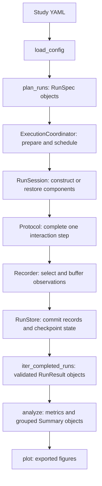

# Reading the code

This guide is a route through the repository for someone inspecting how it works.
Start with one small study, follow its data through the library, and use the tests
to check your understanding. The [architecture](ARCHITECTURE.md) describes the
design rules in more detail; the [configuration guide](CONFIGURATION.md) is the
reference for writing studies.

## Start here

Read these files in order on a first pass:

1. [The sequential study YAML](../examples/sequential_study/experiment.yml):
   identify the algorithm, data generator, protocol, budget, recorded fields,
   metric, and figure. Each is a separate choice.
2. [The example algorithms](../examples/sequential_study/experiment_code/algorithms.py)
   and [data generator](../examples/sequential_study/experiment_code/data.py):
   follow one action and reward. These are the scientific components supplied by
   the paper. `_SampleMeans` holds learned statistics; `GaussianBandit` holds the
   environment's round counter and reads its saved arm means.
3. [The component contracts](../src/experiments_wo_stress/components/contracts.py):
   compare `OnlineAlgorithm`, `DataGenerator`, and `Feedback` with the example.
   The interfaces describe methods a component provides; inheritance from them
   is not required.
4. [The built-in protocols](../src/experiments_wo_stress/builtins/protocols.py):
   read `OnlineProtocol.advance`. This is the smallest complete interaction:
   obtain context, choose an action, generate feedback, update the algorithm,
   increment the step, and return measurements.
5. [The run session](../src/experiments_wo_stress/execution/worker.py):
   read `RunSession.run`, then the methods it calls. This wraps interaction in
   initialization, recording, checkpointing, and completion.
6. [The analysis pipeline](../src/experiments_wo_stress/analysis/pipeline.py):
   read `analyze` to see how saved runs become metrics and grouped summaries.

For the first pass, postpone the details of fingerprints, atomic files, and
notification retries. Return to them using the routes below after the complete
run makes sense.

## Find the implementation

Most implementation lives in six packages under
[`src/experiments_wo_stress/`](../src/experiments_wo_stress/).

| Package | What it owns | First symbols to read |
| --- | --- | --- |
| [`study`](../src/experiments_wo_stress/study/) | Validated configuration, concrete run descriptions, planning, and deterministic random streams. | `ExperimentConfig`, `ComponentSpec`, `RunSpec`, `GridPlanner`, `make_rngs`. |
| [`components`](../src/experiments_wo_stress/components/) | Interfaces for study code and the loading of configured classes. | `Feedback`, `InteractionProtocol`, `construct`, `create_instance`. |
| [`builtins`](../src/experiments_wo_stress/builtins/) | Supplied protocols, data generators, environments, and bandit metrics. | `OnlineProtocol`, `CSVDataGenerator`, `StationaryBandit`, `PseudoRegretMetric`. |
| [`execution`](../src/experiments_wo_stress/execution/) | One invocation's scheduling and each run's component lifecycle. | `ExecutionCoordinator`, `PreparedRequest`, `RunSession`, `RunReport`. |
| [`storage`](../src/experiments_wo_stress/storage/) | Saved instances, result records, checkpoint publication, validation, and cleanup. | `Instance`, `RunResult`, `ExperimentStore`, `RunStore`, `Recorder`. |
| [`analysis`](../src/experiments_wo_stress/analysis/) | The metric interface, aggregation, derived caches, and figure export. | `MetricResult`, `Summary`, `AnalysisCache`, `analyze`, `plot`. |

[`__init__.py`](../src/experiments_wo_stress/__init__.py) lists the convenient
public imports. Historical modules such as
[`runner.py`](../src/experiments_wo_stress/runner.py),
[`settings.py`](../src/experiments_wo_stress/settings.py), and
[`metrics.py`](../src/experiments_wo_stress/metrics.py) mostly re-export names.
Follow their imports into the owning packages to find the implementation.
[`cli.py`](../src/experiments_wo_stress/cli.py) translates command-line arguments
into those same library operations.

## Follow one study through the code



### 1. Turn YAML into independent runs

[`study/config.py`](../src/experiments_wo_stress/study/config.py) loads YAML,
rejects unsupported or inconsistent settings, fills defaults, and resolves paths
relative to the study. `ExperimentConfig` retains the validated study and its
source directory.

[`study/planning.py`](../src/experiments_wo_stress/study/planning.py) expands each
run group. `GridPlanner.plan` crosses parameter values, algorithms, and
repetitions. `plan_runs` checks the resulting descriptions, including duplicate
or invalid identities. A custom planner implements the same `plan(group, seed)`
contract.

[`study/specs.py`](../src/experiments_wo_stress/study/specs.py) defines the plain
descriptions that travel between processes and are saved to disk. A
`ComponentSpec` describes how to construct one component. A `RunSpec` combines
three components, a repetition, a seed, and a requested budget. Follow
`make_run_spec` to see which inputs define the stable run ID.

[`study/rng.py`](../src/experiments_wo_stress/study/rng.py) derives separate streams
for instance generation, environment sampling, algorithm decisions, and protocol
randomness. Data and instance streams can be paired across algorithms. Worker
numbers and traversal positions do not enter these stream identities.

### 2. Decide what work can be reused

[`execution/coordinator.py`](../src/experiments_wo_stress/execution/coordinator.py)
contains `run_experiment` and `ExecutionCoordinator`. Read `run` for the outer
lifecycle: plan, validate component capabilities, collect provenance, acquire the
output lock, publish a request, schedule runs, and finish the report.

The reuse calculation lives in
[`execution/provenance.py`](../src/experiments_wo_stress/execution/provenance.py).
`prepare_request` produces a `PreparedRequest`, mapping scientific run IDs to
stored variants. `ExperimentStore` in
[`storage/experiment.py`](../src/experiments_wo_stress/storage/experiment.py)
publishes those variants and selects the active request.

These identifiers answer different questions:

| Identifier | Question it answers | Where to inspect it |
| --- | --- | --- |
| `RunSpec.run_id` | Which scientific run and repetition is this? Its budget is a separate request. | `make_run_spec` in `study/specs.py`. |
| Stored variant ID (`storage_id`) | Which results match the science, implementation, environment, and recording selection? Budget also distinguishes variants when continuation is unsupported. | `prepare_request` in `execution/provenance.py`. |
| Instance ID | Which immutable scientific input was saved? | `save_instance` and `load_instance` in `storage/experiment.py`. |
| Analysis cache key | Which derived result matches these saved inputs, metric parameters, and source versions? | `source_identity` in `analysis/cache.py` and `_cached_metric` in `analysis/pipeline.py`. |

Source fingerprints cover file contents. Editing a comment or docstring in a
tracked simulation module can therefore select a fresh stored variant; editing
metric source can invalidate its derived cache. This conservative behavior is
useful to remember when inspecting changes that only improve readability.

### 3. Execute one complete interaction step

The coordinator either calls `execute_run` locally or submits it to a process
pool. In both cases,
[`execution/worker.py`](../src/experiments_wo_stress/execution/worker.py) constructs
a `RunSession` with fresh components and RNGs.

Read the session methods in this order:

1. `run` checks for a validated completion covering the request.
2. `restore_or_initialize` loads or generates the immutable instance, constructs
   the algorithm, data generator, and protocol, then restores their checkpoint
   state and RNG state or initializes the protocol.
3. `advance` asks the protocol for exactly one complete step and passes its
   observations to the recorder.
4. `checkpoint` flushes observations and commits component states and RNG states
   at that same boundary.
5. `finalize` publishes a completed result after the final checkpoint; `close`
   releases component resources even after a failure.

The protocol decides interaction order. The algorithm owns learned state. The
generator owns evolving environment state. `RunSession` coordinates their
lifecycle without interpreting the scientific meaning of an action or reward.

`Feedback` explains a key boundary: `value` is delivered to the algorithm, while
`measurements` are available for recording and later evaluation. In the example,
`ClippedFeedbackBandit` makes this distinction visible by retaining `raw_reward`
alongside clipped feedback.

### 4. Understand what a checkpoint commits

Start in [`storage/run.py`](../src/experiments_wo_stress/storage/run.py).
`Recorder.record` applies the recording schedule and checks numerical field
shapes and dtypes. `Recorder.flush` writes result chunks. A chunk on disk becomes
part of a resumable boundary only when the checkpoint references it.

`RunStore.checkpoint` writes a new state generation and publishes the progress
record before pruning old generations. `RunStore.restore` searches for a valid
committed generation, checks its results, and removes uncommitted result tails.
This is where to read about recovery without duplicated observations.
`RunStore.finish` preserves a completed prefix and its checkpoint so later
extensions can coexist with earlier completed budgets.

[`storage/files.py`](../src/experiments_wo_stress/storage/files.py) provides atomic
file writes, checksums, and explicit state packing. Read it after the transaction
sequence above. [`storage/cleanup.py`](../src/experiments_wo_stress/storage/cleanup.py)
handles previewing and removing selected artifacts under the experiment lock.

The saved data types are in
[`storage/models.py`](../src/experiments_wo_stress/storage/models.py).
`Instance` holds immutable scientific input, such as arm means or a dataset.
`RunResult` combines recorded numerical arrays with that instance, the run
description, completion information, and a result revision. Its mapping interface
lets metrics access recorded fields by name.

### 5. Read saved results, compute metrics, and make figures

`iter_completed_runs` in
[`storage/experiment.py`](../src/experiments_wo_stress/storage/experiment.py)
validates the selected completed results and yields one run at a time.

[`analysis/metrics.py`](../src/experiments_wo_stress/analysis/metrics.py) defines
`Metric.compute`, the numerical `MetricResult`, requirement checks, and general
field operations. The bandit definitions of pseudo-regret and realized regret
live in [`builtins/metrics.py`](../src/experiments_wo_stress/builtins/metrics.py).
They consume saved instances and observations through the same metric interface.
Inspect their required data and comparator before using them for a paper.

In [`analysis/pipeline.py`](../src/experiments_wo_stress/analysis/pipeline.py),
`analyze` selects metrics and creates or reuses per-run results.
`_aggregate_metrics` groups compatible repetitions; `_RepetitionAccumulator`
updates the mean and squared deviations without keeping every run in memory.
Each `Summary` holds coordinates, mean, uncertainty, labels, and repetition count.

[`analysis/cache.py`](../src/experiments_wo_stress/analysis/cache.py) contains
`AnalysisCache`, which validates and publishes derived generations.
[`analysis/figures.py`](../src/experiments_wo_stress/analysis/figures.py) turns
summaries into Matplotlib or TikZ output, or calls a custom plotter. Reading saved
results and producing standard figures does not require constructing the study's
simulation components.

## Explore other components when needed

| If you want to understand… | Read… |
| --- | --- |
| One dataset and one estimator fit | `OfflineProtocol` in [builtins/protocols.py](../src/experiments_wo_stress/builtins/protocols.py), then the [offline example](../examples/offline_csv/README.md). |
| One arbitrary callable per repetition | `TrialProtocol` and `NullAlgorithm` in [builtins/protocols.py](../src/experiments_wo_stress/builtins/protocols.py). |
| CSV data, sampling, and immutable inputs | `CSVDataGenerator`, `NormalDataGenerator`, and `NullDataGenerator` in [builtins/data.py](../src/experiments_wo_stress/builtins/data.py). |
| Stationary and changing bandit rewards | `StationaryBandit`, `GaussianBandit`, and `NonstationaryBandit` in [builtins/bandits.py](../src/experiments_wo_stress/builtins/bandits.py). |
| Episodes, termination, and truncation | `RLProtocol` in [builtins/protocols.py](../src/experiments_wo_stress/builtins/protocols.py), then `GymnasiumAdapter` in [builtins/gymnasium.py](../src/experiments_wo_stress/builtins/gymnasium.py) and `EnvironmentStateAdapter` in [components/contracts.py](../src/experiments_wo_stress/components/contracts.py). |
| Component lookup and injected arguments | `resolve_type`, `constructor_kwargs`, and `construct` in [components/loading.py](../src/experiments_wo_stress/components/loading.py). |
| Per-run logging and resource cleanup | [execution/logging.py](../src/experiments_wo_stress/execution/logging.py) and `RunSession.close` in [execution/worker.py](../src/experiments_wo_stress/execution/worker.py). |
| Optional progress messages and retry rules | `ExperimentNotifier` in [execution/notifications.py](../src/experiments_wo_stress/execution/notifications.py). Delivery is coordinated outside worker steps. |

## Use the tests as worked examples

The suite uses `unittest.TestCase` classes and runs with pytest. Module docstrings
state the area covered, class docstrings describe a related group of behaviors,
and individual scenario names explain the expected result. Read the local setup,
the operation under test, and the assertions together. Small fake components keep
the interaction visible; temporary directories isolate persisted artifacts.

| Test file | What it demonstrates |
| --- | --- |
| [test_study.py](../tests/test_study.py) | Configuration validation, planner output, stable identities, and independent random streams. |
| [test_components.py](../tests/test_components.py) | Component loading, aliases, constructor validation, and injected capabilities. |
| [test_protocols.py](../tests/test_protocols.py) | Online feedback boundaries, offline fitting, and callable trials. |
| [test_artifacts.py](../tests/test_artifacts.py) | Immutable instances and the saved-result interface. |
| [test_data_generators.py](../tests/test_data_generators.py) | Saved CSV inputs, generated-data descriptions, and data cursor restoration. |
| [test_bandits.py](../tests/test_bandits.py) | Reward generation, schedules, valid actions, and exact prefixes across extension. |
| [test_gymnasium.py](../tests/test_gymnasium.py) | Environment snapshots, episode boundaries, and restoration through resets. |
| [test_metrics.py](../tests/test_metrics.py) and [test_bandit_metrics.py](../tests/test_bandit_metrics.py) | General numerical metric contracts and explicit bandit comparator definitions. |
| [test_analysis.py](../tests/test_analysis.py) | Aggregation rules, uncertainty, and figure regeneration from saved records. |
| [test_analysis_cache.py](../tests/test_analysis_cache.py) | Cache reuse, invalidation, corruption detection, and exported copies. |
| [test_execution.py](../tests/test_execution.py) | Worker-independent results, pause/resume, retained variants, and recovery after failures. |
| [test_lifecycle.py](../tests/test_lifecycle.py) | Repeated invocations, cleanup, continuation, logging, and source compatibility. |
| [test_storage.py](../tests/test_storage.py) | Instance persistence, state encoding, checkpoint publication, fallback, and result schemas. |
| [test_notifications.py](../tests/test_notifications.py) | Configuration, mocked HTTP delivery, retry timing, and progress reporting. |
| [test_cli.py](../tests/test_cli.py) | CLI planning and real process interruption with SIGTERM. |
| [test_docs.py](../tests/test_docs.py) and [test_llm_guide.py](../tests/test_llm_guide.py) | Documentation checks and execution of the standalone guide's copyable study. |

For a concrete comparison, read a protocol test alongside `OnlineProtocol.advance`,
then a recovery test alongside `RunSession.checkpoint` and `RunStore.restore`.
Analysis tests often supply saved results directly, making it easier to inspect
statistical expectations without running a simulation.

After following [the development setup](../CONTRIBUTING.md#set-up-a-checkout),
run these commands from the repository root:

```bash
python -m pytest --collect-only -q
python -m pytest tests/test_protocols.py -vv
python -m pytest tests/test_bandit_metrics.py -vv
python -m pytest tests/test_execution.py -k resume -vv
python -m pytest tests/test_storage.py -vv
```

The first command lists the suite without running it. The next commands let you
read and execute a small area at a time. The full verification workflow is in
[BUILD_WORKFLOW.md](BUILD_WORKFLOW.md).

## Where a change usually belongs

Follow the owner of the behavior you are changing. A new learning rule belongs in
the study's algorithm code; a new scientific score belongs in a study metric. A
new reusable interaction order starts at the protocol contract. Changes to
worker scheduling belong in the coordinator, while checkpoint boundaries belong
in the run session and store. A plotting change starts from `Summary` and the
figure exporter.

Before editing, find the focused tests for that area and read the associated
invariants in [ARCHITECTURE.md](ARCHITECTURE.md). Keep class documentation focused
on responsibility, owned state, and lifecycle. Add comments where the reason for
an ordering or validation would otherwise be easy to miss.
